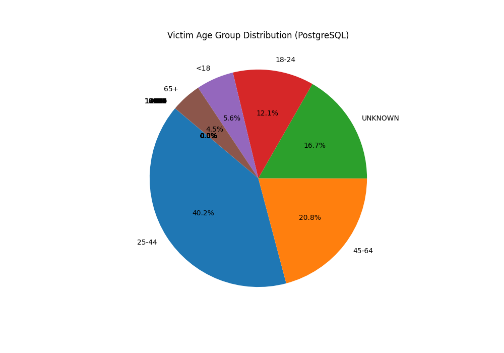
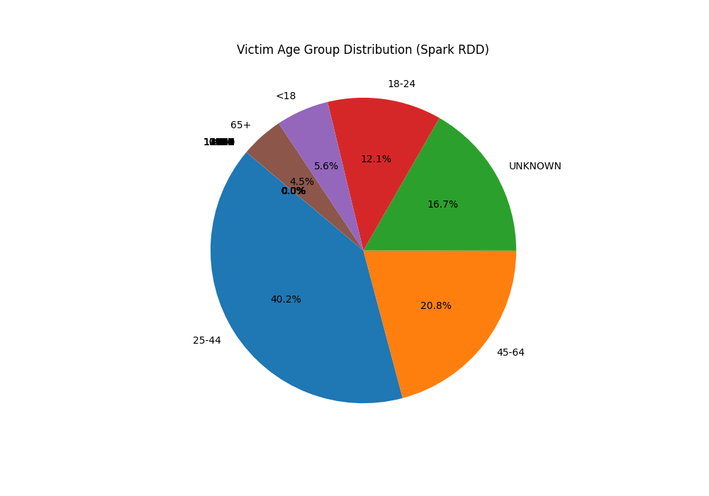

# Results

## Performance Comparison (seconds)

| Task             | Spark Rdd   | Spark Sql   | Postgres   |
|------------------|-------------|-------------|------------|
| Load And Cache   | 11.74       | 2.85        | -          |
| Load And Convert | -           | -           | 179.28     |
| Q1               | 11.65       | 3.48        | 0.56       |
| Q2               | 61.82       | 16.14       | 2.00       |
| Q3               | 41.71       | 10.35       | 1.71       |
| Q4               | 52.63       | 13.33       | 1.93       |
| Q5               | 10.86       | 2.80        | 0.58       |

## Query Results

### Q1: 10 most frequent offenses

| Type                           |   Count |
|--------------------------------|---------|
| PETIT LARCENY                  | 1666745 |
| HARRASSMENT 2                  | 1272980 |
| ASSAULT 3 & RELATED OFFENSES   |  998322 |
| CRIMINAL MISCHIEF & RELATED OF |  916268 |
| GRAND LARCENY                  |  831964 |
| DANGEROUS DRUGS                |  471830 |
| OFF. AGNST PUB ORD SENSBLTY &  |  455183 |
| FELONY ASSAULT                 |  393369 |
| ROBBERY                        |  331515 |
| BURGLARY                       |  310292 |

### Q2: 3 most frequent offenses per Borough

**BRONX**

| Type                         |   Count |
|------------------------------|---------|
| HARRASSMENT 2                |  281854 |
| PETIT LARCENY                |  281235 |
| ASSAULT 3 & RELATED OFFENSES |  249810 |

**QUEENS**

| Type                           |   Count |
|--------------------------------|---------|
| PETIT LARCENY                  |  336803 |
| HARRASSMENT 2                  |  270699 |
| CRIMINAL MISCHIEF & RELATED OF |  211190 |

**MANHATTAN**

| Type          |   Count |
|---------------|---------|
| PETIT LARCENY |  523016 |
| GRAND LARCENY |  312754 |
| HARRASSMENT 2 |  255295 |

**BROOKLYN**

| Type                         |   Count |
|------------------------------|---------|
| PETIT LARCENY                |  453861 |
| HARRASSMENT 2                |  380140 |
| ASSAULT 3 & RELATED OFFENSES |  301087 |

**STATEN ISLAND**

| Type                           |   Count |
|--------------------------------|---------|
| HARRASSMENT 2                  |   84381 |
| PETIT LARCENY                  |   67656 |
| CRIMINAL MISCHIEF & RELATED OF |   56801 |

### Q3: 3 most frequent agencies & their top 3 offenses

**N.Y. POLICE DEPT**

| Type                         |   Count |
|------------------------------|---------|
| PETIT LARCENY                | 1595343 |
| HARRASSMENT 2                | 1128620 |
| ASSAULT 3 & RELATED OFFENSES |  868949 |

**N.Y. HOUSING POLICE**

| Type                         |   Count |
|------------------------------|---------|
| HARRASSMENT 2                |  124950 |
| ASSAULT 3 & RELATED OFFENSES |  100417 |
| DANGEROUS DRUGS              |   78186 |

**N.Y. TRANSIT POLICE**

| Type                           |   Count |
|--------------------------------|---------|
| GRAND LARCENY                  |   26541 |
| CRIMINAL MISCHIEF & RELATED OF |   24574 |
| ASSAULT 3 & RELATED OFFENSES   |   20532 |

### Q4: 4 most frequent locations & their top 3 offenses

**STREET**

| Type                           |   Count |
|--------------------------------|---------|
| PETIT LARCENY                  |  436837 |
| CRIMINAL MISCHIEF & RELATED OF |  380458 |
| DANGEROUS DRUGS                |  280424 |

**RESIDENCE - APT. HOUSE**

| Type                          |   Count |
|-------------------------------|---------|
| HARRASSMENT 2                 |  432687 |
| ASSAULT 3 & RELATED OFFENSES  |  299544 |
| OFF. AGNST PUB ORD SENSBLTY & |  197749 |

**RESIDENCE-HOUSE**

| Type                          |   Count |
|-------------------------------|---------|
| HARRASSMENT 2                 |  196184 |
| ASSAULT 3 & RELATED OFFENSES  |  108307 |
| OFF. AGNST PUB ORD SENSBLTY & |   97755 |

**RESIDENCE - PUBLIC HOUSING**

| Type                         |   Count |
|------------------------------|---------|
| HARRASSMENT 2                |  124410 |
| ASSAULT 3 & RELATED OFFENSES |   99835 |
| DANGEROUS DRUGS              |   76737 |

### Q5: Victim age distribution

| Type    |   Count |
|---------|---------|
| 25-44   | 3166819 |
| 45-64   | 1639842 |
| (null)  | 1623568 |
| UNKNOWN | 1316479 |
| 18-24   |  948535 |
| <18     |  439570 |
| 65+     |  356382 |
| 930     |      18 |
| 936     |      17 |
| 940     |      15 |
| 935     |      14 |
| 938     |      13 |
| 928     |      12 |
| 937     |      12 |
| 946     |      12 |
| 961     |      11 |
| 933     |      10 |
| 929     |      10 |
| 941     |      10 |
| 931     |      10 |
| 939     |      10 |
| 934     |       9 |
| 951     |       9 |
| -2      |       9 |
| 924     |       9 |
| 932     |       9 |
| 945     |       9 |
| 949     |       8 |
| 926     |       8 |
| 942     |       8 |
| 953     |       8 |
| 943     |       8 |
| -1      |       7 |
| 944     |       7 |
| 927     |       7 |
| 922     |       6 |
| 925     |       6 |
| 1023    |       6 |
| -970    |       6 |
| 958     |       6 |
| 947     |       6 |
| 960     |       6 |
| -961    |       5 |
| 955     |       5 |
| -962    |       5 |
| 950     |       5 |
| -3      |       5 |
| 956     |       5 |
| 962     |       5 |
| 808     |       5 |
| -948    |       5 |
| 957     |       5 |
| -943    |       4 |
| -48     |       4 |
| 964     |       4 |
| 948     |       4 |
| 809     |       4 |
| 811     |       4 |
| 963     |       4 |
| 921     |       4 |
| 959     |       4 |
| -973    |       4 |
| -61     |       4 |
| -964    |       4 |
| 1018    |       3 |
| -4      |       3 |
| -971    |       3 |
| 1014    |       3 |
| -959    |       3 |
| 952     |       3 |
| 912     |       3 |
| -975    |       3 |
| 970     |       3 |
| -60     |       3 |
| 923     |       3 |
| 966     |       3 |
| -968    |       3 |
| -5      |       3 |
| -65     |       3 |
| 1022    |       3 |
| 1013    |       3 |
| -40     |       3 |
| -56     |       3 |
| -974    |       3 |
| -967    |       3 |
| 954     |       3 |
| -972    |       3 |
| -934    |       3 |
| -958    |       3 |
| 913     |       3 |
| -30     |       3 |
| 979     |       2 |
| -49     |       2 |
| 969     |       2 |
| 965     |       2 |
| 981     |       2 |
| -966    |       2 |
| -67     |       2 |
| -954    |       2 |
| 812     |       2 |
| 711     |       2 |
| 971     |       2 |
| -942    |       2 |
| 916     |       2 |
| -51     |       2 |
| -965    |       2 |
| 920     |       2 |
| 454     |       2 |
| -956    |       2 |
| 900     |       2 |
| -945    |       2 |
| -963    |       2 |
| -951    |       2 |
| -32     |       2 |
| 342     |       2 |
| -938    |       2 |
| -63     |       2 |
| -39     |       2 |
| -6      |       2 |
| 908     |       2 |
| 915     |       2 |
| -55     |       2 |
| -955    |       2 |
| -72     |       2 |
| -978    |       2 |
| 917     |       2 |
| -952    |       2 |
| 507     |       2 |
| 886     |       2 |
| 807     |       2 |
| -960    |       2 |
| 741     |       2 |
| -931    |       1 |
| 188     |       1 |
| 2007    |       1 |
| -70     |       1 |
| 1963    |       1 |
| 1016    |       1 |
| 688     |       1 |
| 1019    |       1 |
| 172     |       1 |
| 11210   |       1 |
| -939    |       1 |
| -884    |       1 |
| 458     |       1 |
| 390     |       1 |
| 1957    |       1 |
| -50     |       1 |
| 838     |       1 |
| 407     |       1 |
| -932    |       1 |
| -11     |       1 |
| 758     |       1 |
| -953    |       1 |
| 315     |       1 |
| 321     |       1 |
| -935    |       1 |
| -940    |       1 |
| 526     |       1 |
| -71     |       1 |
| 858     |       1 |
| 1230    |       1 |
| 158     |       1 |
| 200     |       1 |
| 469     |       1 |
| 151     |       1 |
| 174     |       1 |
| -10     |       1 |
| 10451   |       1 |
| 1972    |       1 |
| -926    |       1 |
| 999     |       1 |
| 308     |       1 |
| -43     |       1 |
| 508     |       1 |
| 911     |       1 |
| -81     |       1 |
| -69     |       1 |
| 791     |       1 |
| 895     |       1 |
| 1115    |       1 |
| 967     |       1 |
| -76     |       1 |
| -921    |       1 |
| 918     |       1 |
| 1480    |       1 |
| 422     |       1 |
| 297     |       1 |
| -66     |       1 |
| 972     |       1 |
| 595     |       1 |
| -27     |       1 |
| -7      |       1 |
| 1012    |       1 |
| 318     |       1 |
| 213     |       1 |
| 910     |       1 |
| 982     |       1 |
| 509     |       1 |
| 2044    |       1 |
| 359     |       1 |
| -59     |       1 |
| 707     |       1 |
| -944    |       1 |
| 562     |       1 |
| -936    |       1 |
| 334     |       1 |
| 806     |       1 |
| -981    |       1 |
| 977     |       1 |
| 1921    |       1 |
| 978     |       1 |
| -980    |       1 |
| -46     |       1 |
| 340     |       1 |
| 914     |       1 |
| 1221    |       1 |
| 909     |       1 |
| 3019    |       1 |
| 919     |       1 |
| -28     |       1 |
| 980     |       1 |
| 983     |       1 |
| 208     |       1 |
| 153     |       1 |
| 159     |       1 |
| 323     |       1 |
| 2006    |       1 |
| 1642    |       1 |
| -53     |       1 |
| -64     |       1 |
| 250     |       1 |
| 1068    |       1 |
| 2125    |       1 |
| -58     |       1 |
| 1353    |       1 |
| 1003    |       1 |
| 420     |       1 |
| -52     |       1 |
| 345     |       1 |
| -57     |       1 |
| 708     |       1 |
| 160     |       1 |
| 1020    |       1 |
| 901     |       1 |
| 1017    |       1 |
| 623     |       1 |
| 1445    |       1 |
| -950    |       1 |
| -31     |       1 |
| -33     |       1 |
| 11230   |       1 |
| 710     |       1 |
| -73     |       1 |
| -946    |       1 |
| 2211    |       1 |
| -62     |       1 |
| 500     |       1 |
| 260     |       1 |
| 1955    |       1 |
| 984     |       1 |
| 1900    |       1 |
| 395     |       1 |
| 173     |       1 |
| 1011    |       1 |
| -45     |       1 |
| -929    |       1 |
| 4219    |       1 |
| 184     |       1 |
| 427     |       1 |
| -924    |       1 |
| 650     |       1 |
| 152     |       1 |
| 1951    |       1 |
| 3642    |       1 |
| 1553    |       1 |
| 310     |       1 |
| 737     |       1 |
| -937    |       1 |
| 1320    |       1 |
| 309     |       1 |
| 10622   |       1 |
| 10308   |       1 |
| -902    |       1 |
| 520     |       1 |
| 1001    |       1 |
| -37     |       1 |
| -36     |       1 |
| 551     |       1 |
| 1590    |       1 |
| 331     |       1 |

## Visualizations

### Postgres Q5

### Spark Rdd Q5

### Spark Sql Q5

